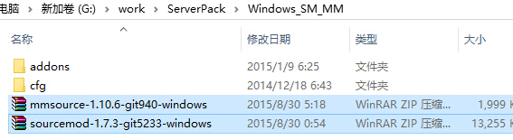
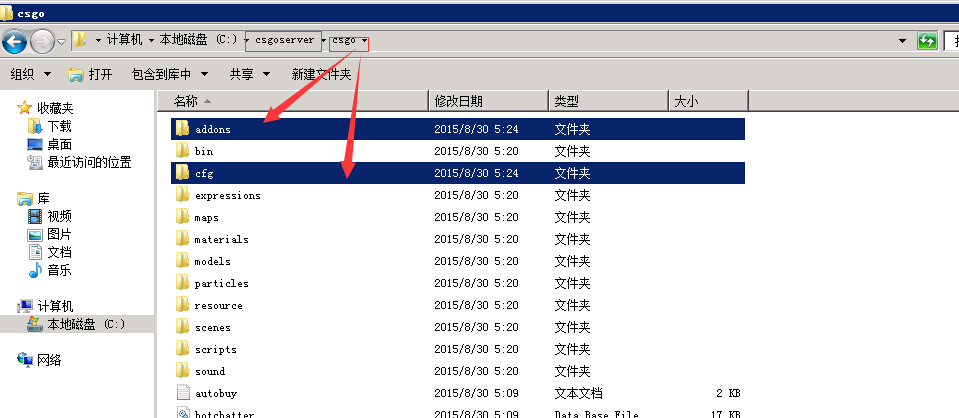

# 服务器插件安装

## 插件基础目录
```
.
├── csgo
│   ├── addons (插件放置位置)
│   │   ├── metamod（请勿修改）
│   │   └── sourcemod (插件放置位置)
│   │       ├── bin（插件基础文件 请勿修改）
│   │       ├── configs（插件配置文件）
│   │       ├── data（插件基础数据文件 请勿修改）
│   │       ├── extensions（插件扩展文件）
│   │       ├── gamedata（插件扩展文件）
│   │       ├── plguins（插件文件）
│   │       │   └── disabled（插件禁用）
│   │       ├── scripting（插件代码脚本）
│   │       ├── translations（插件国际化）
│   │       └── LICENSE.txt（插件协议）
│   │ 
│   ├── models（模型文件）
│   ├── materials（材质文件）
│   │   
│   └── maps（地图文件）
│ 
└── package.json
```
::: warning 警告
以上仅展示插件基础目录结构 不同插件目录有些许不同
:::
- csgo/addons: 用于存放服务器插件
- csgo/addons/metamod: 服务器插件加载扩展请勿修改
- csgo/addons/sourcemod: 服务器所有插件均放在这里
- csgo/addons/sourcemod/bin: 服务器插件加载扩展请勿修改
- csgo/addons/sourcemod/configs: 插件基础配置文件例如：商店插件菜单配置，服务器admin权限配置等均在此处
- csgo/addons/sourcemod/data: 服务器插件加载扩展请勿修改
- csgo/addons/sourcemod/extensions: 服务器插件扩展程序由于插件基础功能增强 例如：手摸修复功能 第一人称显示人们手摸与官方模型模型重叠问题
- csgo/addons/sourcemod/gamedata: 服务器插件加载扩展请勿修改
- csgo/addons/sourcemod/plguins: 服务器编译后插件文件，通常是 xxx.smx 如果想禁用插件 只需将对应的smx文件拖入disabled文件夹下即可
- csgo/addons/sourcemod/scripting: 服务器插件运行的原始代码脚本
- csgo/addons/sourcemod/translations: 服务器插件显示的语言 英语 俄语 日语 汉语 默认为英语（必将老外写的插件居多 需要汉化 只能自己来写翻译）
- csgo/addons/sourcemod/LICENSE: 服务器插件遵循的协议 部分插件可以开源可以商用 部分不同 如果事情请查看对应协议内容

## 安装介绍

CSGO 所有插件运行 依赖于SourceMod（SM） + MetaMod（MM）
所以我们需要需要先下载这2个平台
SM  [http://www.sourcemod.net/snapshots.php](http://www.sourcemod.net/snapshots.php) //选择最新的 就可以了
MM  [http://www.sourcemm.net/snapshots](http://www.sourcemm.net/snapshots) //根据服务器操作系统类型 选择最新的就可以了

同时选中他们 解压到当前文件夹即可.



安装也是很无脑的也只需将它们放入服务器
csgo目录下即可
注意是 csgoserver/csgo/ 下面



安装好这2个你就可以安装其他插件了 比如满10 死斗什么的

这是推荐的插件包 只需把addons覆盖到 csgoserver/csgo下即可

rar打包的插件内包含以下插件 可大大方便你对服务器的操作（建议安装） ,  必须先安装好SourceMod 以及 MetaMod 再安装简易插件包（检查SM MM安装好后 是否正常运行？ 启动服务器后 服务器窗口输入 sm version 如果能返回版本号说明成功!）

[addons简易插件包_v2_89.zip](https://bbs.93x.net/forum.php?mod=attachment&aid=MjMxODN8M2NhM2M3Mjl8MTYwODY1NDE4N3wzNzY1NHwyNTY3MA%3D%3D)

整合了一些必备功能.
1. 默认SourceMod 语言设为中文
2. 服务器中文名 （修改方法 !admin 按服务器管理即可设置.）
3. IP/地理位置显示
4. Sourcemod  GeoLanguage 多国语言 根据IP 会自动为客户端切换 也可以!language  可以切换
5. 移动玩家队伍
6. 服务器设置工具 可从服务器内为服务器加密码，改名 加OP 加参数，设置通道 / 设置用户权限到期 解Ban 等


//
其他插件可以从
[www.sourcemod.net/plugins.php](www.sourcemod.net/plugins.php) 搜索 比如满10就是 warmod
一般社区很常见的插件都可以找到 私人插件就只能自己想办法了.


