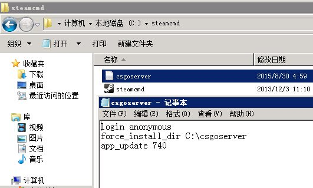
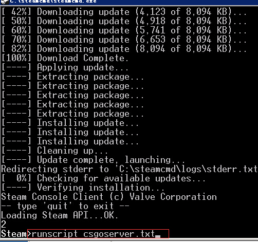
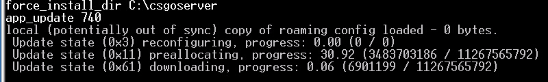
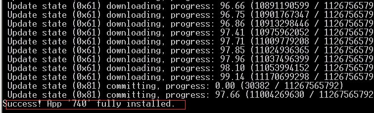

# 快速搭建（window）

::: tip
教程环境 Windows Server 2008 R2  PS ：其实支持任何系统 windows2003 / XP 7 / 8 ，8.1 / 10 都可以
教程路径 C盘 下面说法C盘以X盘表示 可以自己换
:::

基本需求
独立IP或具有外网端口映射权限 ，映射端口相关 请自行百度
服务器网络一般不需要映射端口（具有独立IP）可以无视映射端口相关内容
注意 如果你的网络环境 未开放UDP协议 将无法 运行服务器和下载.

### SteamCMD 处理

下载地址：[下载](https://steamcdn-a.akamaihd.net/client/installer/steamcmd.zip)

在X盘 分别建立2个文件夹  目录名不要空格中文等 要简单简洁 这是防止出问题必须要做的!
steamcmd
csgoserver


把steamcmd 解压 并把 steamcmd.exe 放到 X:\steamcmd
建立1个文本文件 .txt 命名为 csgoserver.txt （文件名可以自己定义）
csgoserver.txt 里面写如下内容并保存

```sh
login anonymous
force_install_dir C:\csgoserver             注意你的盘符和路径
app_update 740
```

所以现在应该是这样的



然后运行steamcmd.exe ,等待程序自动更新完成


当显示OK的时候
输入 runscript csgoserver.txt  （你建立的TXT文件）



此时就会下载服务端了 你要做的只是等待



有一些特殊情况比如下载网络不佳中断可能ERROR 不过没关系
先关闭程序
只需再次运行 steamcmd.exe
然后输入  runscript csgoserver.txt 即可 不会重新下载 支持断点续传的! （要更新服务器也是这样做 请记住！）


这就是代表下载成功 如果不是Success  则代表下载或者安装失败 失败的话 关闭程序再次 执行上述2个操作。直到成功.
