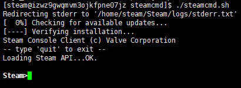
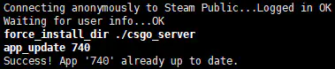
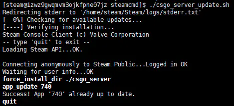
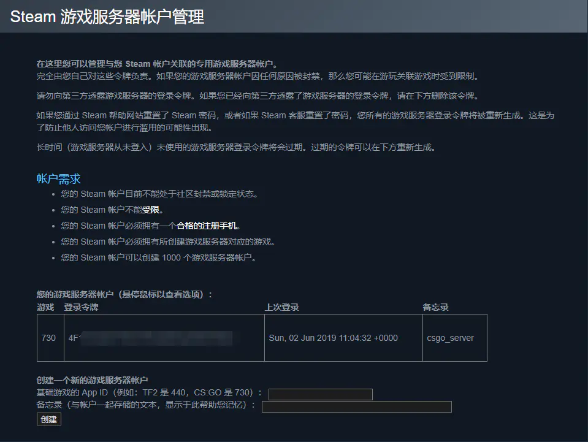
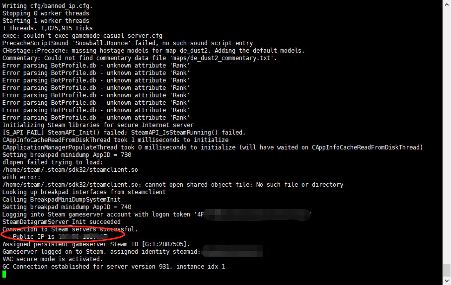

# 快速上手 （linux）
::: tip
教程环境以centos7.x 云服务器为主要环境（其实偷懒了，自己本地机器也可以搭建，不过需要进行网络穿透。云服务器又独立ip，无需网络穿透），如果有其他问题请在下方回复出提出
:::
### 创建新用户，安装steamcmd，安装CS:GO服务端

1. 使用ssh以root用户身份登录到服务器，创建名为steam的用户，并切换到该用户和该用户的根目录下（用户名可以自行选择，但在后续的操作中，路径需要进行替换）

```sh
useradd -m steam    // 添加名为steam的用户
su steam    // 切换到steam用户
cd /home/steam/    // 切换到steam用户的根目录下

```

2. 创建名为steamcmd的文件夹，下载steamcmd并解压

```sh
mkdir steamcmd    //创建名为steamcmd的文件夹
cd steamcmd/    // 切换到文件夹目录下
wget https://steamcdn-a.akamaihd.net/client/installer/steamcmd_linux.tar.gz    //下载steamcmd
tar zxvf steamcmd_linux.tar.gz    // 解压steamcmd
rm steamcmd_linux.tar.gz    //删除下载的安装包，也可以保留

```

3. 安装运行steamcmd所需的环境，运行steamcmd并安装CS:GO服务端

```sh
sudo yum install glibc.i686    // 安装steamcmd运行所需的库
sudo yum install libstdc++.i686    // 有的主机已经安装其他同样效果的依赖，不用多次安装
./steamcmd.sh
```

在操作无误的情况下，看到下面的命令行之后，steamcmd就安装完成了<br>


#### 接下来便是在steamcmd中安装CS:GO
以匿名用户身份登录steamcmd

```sh
login anonymous
```


创建CS:GO服务器文件夹，该文件夹在steamcmd文件夹目录下

```sh
force_install_dir ./csgo_server
```

安装csgo服务端（15分钟左右）

```sh
app_update 740 validate
```

在看到如下图片中最后的行的"Success!"后，表明CS:GO服务端安装成功（此处使用了更新成功的图片，但同样是"Success!"字样）<br>


安装完成后，退出steamcmd

```sh
quit
```

### 编写CS:GO更新脚本（可选）

1. 编写steamcmd的runscript脚本
在steamcmd目录下（退出steamcmd.sh后的当前目录），使用vim创建新的update.txt文件

```sh
vi update.txt
```

进入编辑模式，写入以下语句，然后保存退出

```sh
login anonymous
force_install_dir ./csgo_server
app_update 740
quit
```

2. 编写steamcmd运行脚本

在steamcmd目录下，使用vim创建新的csgo_server_update.sh文件

```sh
vi csgo_server_update.sh
```

进入编辑模式，写入以下语句后保存退出

```sh
#!/bin/bash
./steamcmd.sh +runscript update.txt
```

3. 测试脚本

在steamcmd目录下运行脚本csgo_server_update.sh

```sh
./csgo_server_update.sh
```

若运行结果如下所示，则更新脚本编写完成，以后可以直接使用该命令一键更新CS:GO服务器



若出现了权限不足的情况，提升权限再次运行即可

```sh
chmod 775 csgo_server_update.sh
```

### 配置并运行CS:GO服务端

1. 前往[Steam游戏服务器帐户管理](https://links.jianshu.com/go?to=https%3A%2F%2Fsteamcommunity.com%2Fdev%2Fmanagegameservers)注册steam服务器登录令牌。没有该令牌服务器只能在本地网络中进行连接，在社区服务器浏览器中也不会显示。（网站可能无法连接，推荐使用Steamcommunity 302工具修复连接问题）<br>

在App ID中填入CS:GO的ID：730。备忘录中填入：CSGO服务端令牌（选填）<br>



点击创建之后便获得了登录令牌，不要将该令牌泄露出去，该令牌用于服务器在CS:GO社区服务器中验证

2. 下载服务器配置文件server.cfg

切换目录到CS:GO的cfg文件夹下，下载server.cfg文件，编辑server.cfg文件

```sh
cd csgo_server/csgo/cfg/
wget http://www.csgodev.com/downloads/server.cfg
vi server.cfg
```

进入编辑模式，在server.cfg文件中添加登录令牌，修改部分参数（这部分一定要改，不然很影响游戏体验！）

``` 
rcon_password ""
//sv_password "" //Only set this if you intend to have a private server!
mp_freezetime 0 //The amount of time players are frozen to buy items
mp_join_grace_time 15 //The amount of time players can join teams after a round has started
mp_match_end_restart 0 // Defines whether a map should be restarted after a game has ended 
sv_cheats 0 //This should always be set, so you know it's not on
sv_lan 0 //This should always be set, so you know it's not on
//**The bot commands below are mostly default with the exception of 
bot_join_after_player 0
bot_quota 0
bot_quota_mode "fill"
//**The following commands manage kicks and bans
exec banned_user.cfg
exec banned_ip.cfg
writeid
writeip
mp_maxrounds "0"
mp_autokick "0"
mp_winlimit "0"


sv_allowupload 1
sv_allowdownload 1
mp_autoteambalance 0
mp_limitteams 0
sv_pure 0
sv_minrate "16000" 
sv_maxrate "128000"
sv_infinite_ammo 0
host_info_show "2"
host_players_show "2"
sv_tags "multi1v1,1v1,arena,1v1arena"

//ServerLogo
//sv_server_graphic1 logo1.png
//sv_server_graphic2 logo2.png


sv_hibernate_when_empty 0
mp_endmatch_votenextmap 0


// Performance
sv_occlude_players 0
// steam account，修改为自己刚刚申请的登陆令牌
sv_setsteamaccount  "xxxxxxxxxxxxxxxxxxxxxxxxxxxxxxxxxxx"
```
修改完以上参数之后，服务器便可以启动了

3. 开放UDP 27015端口
前往云服务器控制台防火墙控制面板，添加防火墙规则  开放UDP端口 27015

> 服务器端口分常用的 TCP/IP协议端口以及 UDP协议端口  不同的协议可以对应相同端口号

4. 安装screen，启动CS:GO服务器
安装screen，以便CS:GO服务进程在后台运行

```sh
sudo install screen
```
返回csgo_server目录，使用screen创建新的会话

``sh
cd /home/steam/steamcmd/csgo_server/
screen -S csgo
```
注意：当screen会话未结束时，在下次ssh登陆时可以使用命令"screen -r csgo"来恢复会话
此时屏幕会清屏，说明你成功进入到"csgo"这个会话当中，这时开始启动服务器

```sh
./srcds_run -debug -game csgo -console -port 27015 -steamcmd_script /home/steam/steamcmd/update.txt -steam_dir /home/steam/ +map de_dust2
```
若系统提示没有srcds_run这个文件，则是你当前的文件夹目录不正确

> 参数解释：<br>
> -debug 开启调试模式<br>
> -game 指明游戏，此处是csgo<br>
> -console 打开游戏控制台<br>
> -port 游戏服务器端口，此处是27015<br>
> -steamcmd_script 运行steamcmd的脚本文件地址<br>
> -steam_dir Steam的安装地址<br>
> +map 服务器加载的地图（此处只能用官方地图，创意工坊地图请看后面）<br>

当看到如下图所示的界面之后，说明服务器成功地运行，可以在游戏中连接了
